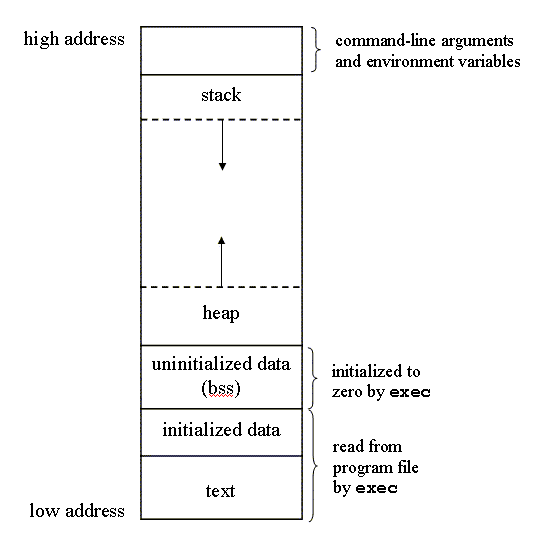

Memory

# Memory

Image result for virtual memory model

---
 Note:- 
- **stack** - Used for storing function arguments and local variables 
- **heap** - dynamic memory
- **text** - program code
---

1. Stack(LIFO): The stack stores local variables, information relating to function calls, and other information used to clean up the stack after a function or procedure is called.(grows down) 
2. Unused Memory: As Memory Segment name highlighting, This Segment is for unused memory. 
3. Heap(FIFO): heap is a Dynamic Memory and stores dynamic variables.(grows up)  
4. .bss(writeable): Basically, This Segment is for storing Uninitialized Value/data. 
5. .data(writeable): This Segment is for storing initialize value/data. 
6. .text(read only): This segment of virtual memory is for storing program executable instruction codes/ holds the pogram instructions. 