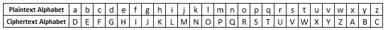

Ciphers

# Ciphers

### Ceaser shift ciphers 

The Shift (or Caesar) Cipher is another monoalphabetic substitution cipher. Although more secure than the Atbash Cipher, it is still an easy cipher to break, especially by today's standards. Originally, it was used by Julius Caesar for sending encrypted messages to his troops  

That is, "a" was encrypted as "D", "b" as "E", etc. The table below gives the plaintext alphabet   

